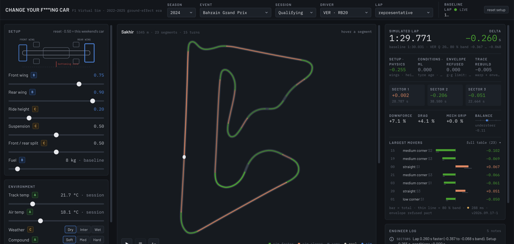

# Change Your F\*\*\*ing Car — an F1 setup & conditions simulator on real telemetry

> Pick a real 2022–2025 Formula 1 lap. Move the wings, the ride height, the
> suspension, the fuel load, the tyre age, the track temperature or the weather.
> Watch where on the circuit the lap gets faster or slower, by how much, with what
> confidence — and replay the real car against the simulated one.

**Live demo:** **https://change-your-car.onrender.com** · **Data:** 184 sessions, 92 events × Q/R, 2022–2025 (FastF1) · **Stack:** Python / FastAPI / LightGBM · Next.js / hand-drawn SVG

> **Before you click:** the demo runs on Render's free tier, which puts the server to
> sleep after 15 minutes without visitors. The first request after that takes
> **30–60 seconds** while the container starts (you may see a blank page or a browser
> timeout — reload once). After that a simulation takes ~0.3 s. The repository
> also builds and runs locally with three commands (see *Run it*). A paid instance
> would remove the delay; for a portfolio prototype the free tier was the deliberate
> choice.



*2024 Bahrain GP qualifying, VER's representative lap, on the live demo: more front and rear wing and a lower ride height. Corners gain (green), straights lose (orange); the lap is 0.260 s faster with an 80 % band of −0.367 … −0.068 s, and the delta splits into setup −0.255, conditions 0, envelope refused 0, trace rebuild −0.005.*

---

## What it does

1. **Docking.** Choose season → event → session (qualifying or race) → driver → lap. The
   baseline is the driver's *representative* clean push lap (the median one, not the lucky
   one), or the fastest, or any lap of the session.
2. **Setup (physics).** Six sliders — front wing, rear wing, ride height, suspension
   stiffness, front/rear split, fuel — expressed as *changes relative to the lap actually
   driven* (0.50 = that weekend's car), because no team publishes its setup.
3. **Conditions (ML).** Tyre age, compound, track and air temperature, weather.
4. **Answer.** Per-segment time deltas with an 80 % band, colour-coded on the circuit map;
   the reconstructed telemetry (speed, throttle, brake, DRS) overlaid on the real one with
   Δspeed and running Δtime rows; a replay of real vs simulated car with the live gap; a
   rule-based engineer log; and a split of the lap delta into *setup / conditions /
   envelope-refused / trace-rebuild* that adds up exactly.

The HUD is deliberately 2D and dependency-light: every chart and the track map are
hand-written SVG. First load is 121 kB of JavaScript; a simulation computes in ~15 ms on a laptop and ~300 ms on the free hosted instance.

## How it works

```
FastF1 ─► warm_cache ─► ingest ─► segment ─► features ─► LightGBM q10/q50/q90 ─► FastAPI ─► Next.js HUD
                         bronze    silver      gold          artifacts/models       baselines   (static export,
                                                                  ▲                     ▲        same origin)
                              physics modifiers (sliders → ΔCl / ΔCd / Δgrip)    reconstruction (Δt → trace)
```

- **Ingest** filters laps (track status → pit → deleted → accurate → gap safety net →
  conditions-matched 107 % pace gate), *tags* rather than drops ambiguous cases (wet,
  yellow flags, telemetry quality), and writes a bronze parquet lake.
- **Segment** builds an ensemble racing line per circuit (16 phase-locked laps), splits
  it by curvature into straights / kinks / low-, medium-, high-speed corners, and checks
  itself against physics (no corner may hide inside a "straight"; no corner over 6.5 g).
- **Features** integrate raw telemetry inside each segment — no uniform resampling, so
  no invented detail — and produce 2.6 M segment rows.
- **Physics** turns the setup sliders into coefficient changes with an explicit formula
  per axis and a **grade** per coefficient: A = learned from data, B = physics with the
  coefficient size checked on our own data, C = literature value only.
- **ML** is a two-level model: three LightGBM quantile regressors (q10/q50/q90) on the
  segment delta versus the session reference, conformally calibrated, plus a
  session-level sector model that is *reported but not applied* (see the model card for
  why).
- **Reconstruction** warps the real speed trace segment by segment until each segment's
  time matches the requested delta, clamps it to a g-g envelope anchored on the real lap,
  and re-synthesises throttle, brake, gear and DRS.
- **API** serves precomputed baselines (JSON per session) and one `POST /api/simulate`
  that returns everything the HUD draws.

## Results (model `v2026.09.17-1`, 184 sessions, 81 training events)

| Metric | Cross-validated (GroupKFold by event) | Unseen circuit (Miami, never trained or calibrated on) |
|---|---|---|
| Segment MAE, q50 | **0.062 s** | 0.078 s |
| Lap counterfactual MAE (clean-air push laps vs the driver's representative lap) | **0.474 s** — "no change" would score 0.659 s | 0.443 s (0.589) |
| Skill (1 − MAE / no-change) | **28 %** | 25 % |
| Noise floor (two consecutive clean push laps, same driver, same tyres) | 0.339 s → **skill ceiling 49 %** | — |
| 80 % band coverage after calibration | 0.80 | 0.81 |

The model reaches 58 % of what a perfect model could reach on this data; the rest is
lap-to-lap variance that no pre-lap feature can see. Details, gates, what failed and why
in [`docs/MODEL_CARD.md`](docs/MODEL_CARD.md).

## Principles

1. **No number without a band.** Every delta carries an 80 % interval; interpolated
   telemetry is hatched; unverifiable coefficients are marked grade C on the slider.
2. **Physics owns the setup, ML owns the conditions.** There is no public setup data, so
   setup effects come from explicit formulas; tyre and temperature effects, which *are*
   in the data, are learned. The two are added, and the parts that the reconstruction
   could not honour (envelope refusals, rebuild residual) are shown, not hidden.
3. **Measure, then decide.** Thresholds come from printed distributions, not guesses;
   the noise floor was measured before any lap-level gate was set.
4. **No stage without a gate — and no silent failures.** Models that miss a gate are
   not registered as latest; if one is accepted anyway the reason is written into the
   registry. The [defect list](docs/DEFECTS.md) (32 entries) records every mistake,
   its cause and what changed.

## Documents

| | |
|---|---|
| [`docs/DESIGN.md`](docs/DESIGN.md) | From idea to deployment: the decisions and why they were taken |
| [`ROADMAP.md`](ROADMAP.md) | The 10-stage plan, each stage's gate, and what actually happened |
| [`docs/MODEL_CARD.md`](docs/MODEL_CARD.md) | The ML model: features, metrics, gates, limitations |
| [`docs/DEFECTS.md`](docs/DEFECTS.md) | 32 defects and lessons, in the order they were found |
| [`docs/recon/DECISIONS.md`](docs/recon/DECISIONS.md) | The reconnaissance gate: nine data decisions and two revisions |

## Run it

```bash
make setup          # python venv + npm install  (Node.js ≥ 20)
make api            # FastAPI  :8000   (separate terminal)
make dev-fe         # Next.js  :3000   → http://localhost:3000
```

Rebuild the data and the model (FastF1 downloads are rate-limited; the cache is resumable):

```bash
make warm-bg        # download raw sessions in the background · make warm-status
make expand         # ingest → segment → features → baselines for every cached Q/R session
make train          # quantile GBMs + gates → data/artifacts/models/<version>
make test           # 165 pytest: physics monotonicity · segmentation · model · reconstruction · API contract
make api-smoke      # 8 end-to-end cases on 2024 Bahrain Q, VER
make fe-check       # tsc + lint + next build
```

## Deployment

One container (`Dockerfile`) serves the FastAPI backend and the statically exported HUD
on the same origin — one URL, no CORS. The baselines (184 session JSONs, 93 MB) and the
registered model (5.5 MB) are committed so the service builds straight from this
repository: a push to `main` rebuilds and redeploys automatically (`render.yaml`,
build ≈ 2 minutes).

| | |
|---|---|
| Host | Render, free tier (`plan: free`, region Singapore) |
| Live URL | https://change-your-car.onrender.com |
| Health check | `GET /health` → `{"status":"ok","model_version":"v2026.09.17-1",…}` |
| Cold start | 30–60 s after 15 min idle; ~300 ms per simulation when warm (0.1 shared CPU — ~15 ms on a laptop) |
| Memory | 512 MB available, ~300 MB used |
| Alternative | `make deploy` targets Google Cloud Run (same container, no sleep, 2-instance spend cap) |

Known limitations of the free tier, stated so nobody is surprised: the sleep/cold-start
above; a single shared instance (fine for a handful of concurrent visitors, not for a
front-page spike); no custom domain. None of these change the numbers the app shows.

## Layout

| Path | Role |
|---|---|
| `backend/pipeline/ingest` · `segment` · `features` | Batch data pipeline (bronze → silver → gold) |
| `backend/pipeline/physics/` | Sliders → physics coefficients, graded (`configs/physics.yaml`) |
| `backend/pipeline/models/` | Quantile GBMs, conformal bands, counterfactual evaluation, registry |
| `backend/pipeline/reconstruct/` | Segment deltas → continuous telemetry (g-g envelope clamp) |
| `backend/app/` | FastAPI: `/api/meta/*`, `/api/baseline`, `POST /api/simulate` |
| `frontend/src/` | Next.js 15 HUD, no chart library |
| `backend/configs/` | `scope.yaml` · `physics.yaml` · `model.yaml` · `circuits.yaml` · `chassis.yaml` |
| `data/artifacts/` | Baselines (184 sessions) and the registered model — committed for repo-based builds |

## About

Solo project by **PARK, SEHO** (September 2026): concept, architecture, data pipeline,
physics model, ML model, API and HUD. Data from FastF1 (public F1 timing and telemetry).
No team setup data exists publicly; every setup axis is expressed as a change relative to
the lap actually driven. MIT licence.
