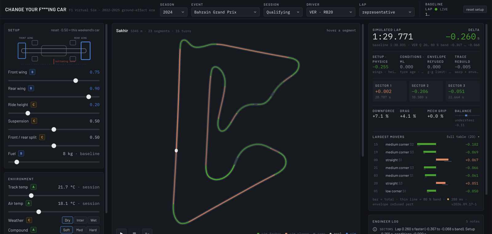
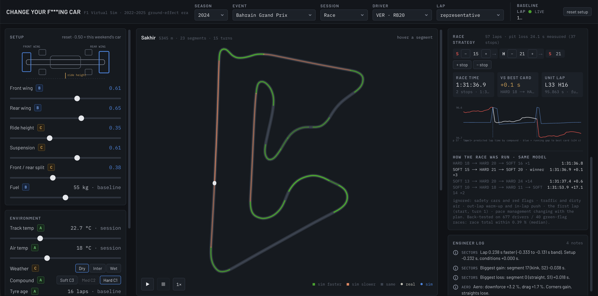

# Change Your F\*\*\*ing Car — an F1 setup & conditions simulator on real telemetry

> Pick a real 2022–2025 Formula 1 lap. Move the wings, the ride height, the
> suspension, the fuel load, the tyre age, the track temperature or the weather.
> Watch where on the circuit the lap gets faster or slower, by how much, with what
> confidence — and replay the real car against the simulated one.

**Live demo:** **https://change-your-car.onrender.com** · **Data:** 184 sessions, 92 events × Q/R, 2022–2025 (FastF1) · **Stack:** Python / FastAPI / LightGBM · Next.js / hand-drawn SVG

> **Before you click:** the demo runs on Render's free tier, which puts the server to
> sleep after 15 minutes without visitors. The first request after that takes
> **30–60 seconds** while the container starts (you may see a blank page or a browser
> timeout — reload once). After that a simulation takes ~0.3 s. The repository
> also builds and runs locally with three commands (see *Run it*). A paid instance
> would remove the delay; for a portfolio prototype the free tier was the deliberate
> choice.



*2024 Bahrain GP qualifying, VER's representative lap, on the live demo: more front and rear wing and a lower ride height. Corners gain (green), straights lose (orange); the lap is 0.260 s faster with an 80 % band of −0.367 … −0.068 s, and the delta splits into setup −0.255, conditions 0, envelope refused 0, trace rebuild −0.005.*

---

## What it does

1. **Docking.** Choose season → event → session (qualifying or race) → driver → lap. The
   baseline is the driver's *representative* clean push lap (the median one, not the lucky
   one), or the fastest, or any lap of the session.
2. **Setup (physics).** Six sliders — front wing, rear wing, ride height, suspension
   stiffness, front/rear split, fuel — expressed as *changes relative to the lap actually
   driven* (0.50 = that weekend's car), because no team publishes its setup.
3. **Conditions (ML).** Tyre age, compound, track and air temperature, weather. The
   tyre controls are bounded by what the field actually did that weekend: only the
   compounds that were run, tyre age up to the longest real stint, and the race's actual
   strategies (compound sequence, median stint lengths, count, winner) shown alongside.
4. **Answer.** Per-segment time deltas with an 80 % band, colour-coded on the circuit map;
   the reconstructed telemetry (speed, throttle, brake, DRS) overlaid on the real one with
   Δspeed and running Δtime rows; a replay of real vs simulated car with the live gap; a
   rule-based engineer log; and a split of the lap delta into *setup / conditions /
   envelope-refused / trace-rebuild* that adds up exactly.

The HUD is deliberately 2D and dependency-light: every chart and the track map are
hand-written SVG. First load is 121 kB of JavaScript; a simulation computes in ~15 ms on a laptop and ~300 ms on the free hosted instance.

## Reading the HUD

| Panel | What it shows |
|---|---|
| **Top bar** | Season → event → session → driver → lap. `BASELINE LAP ● LIVE` means the real lap and its trace are loaded; `reset setup` returns every slider to that weekend's car. |
| **SETUP** | A 2D schematic of the car and six sliders — front wing, rear wing, ride height, suspension, front/rear split, fuel — as changes relative to the lap actually driven (0.50 = as raced). The chip beside each name is the evidence grade of its coefficient: **A** learned from data, **B** physics with a published constant, **C** literature value that public data cannot verify. |
| **ENVIRONMENT** | Track and air temperature (session values by default), weather (dry / intermediate / wet), compound and tyre age. The compound buttons name the Pirelli C-compound behind them; compounds nobody raced that weekend are greyed; tyre age stops at the longest stint anyone ran. |
| **Track map** | The circuit from the measured racing line, split into its segments. After a simulation each segment is coloured by its time delta (green faster, orange slower); hovering a segment prints its kind, length and delta. The ▶ / ■ / `1×` controls replay the real and the simulated car from the line with the live gap. |
| **Telemetry overlay** (below the map) | Speed, throttle, brake and DRS of the real lap with the simulated lap drawn over it, plus Δspeed and running Δtime rows; interpolated stretches are hatched. |
| **Headline** | Simulated lap time and the delta to the real lap with its 80 % band; beneath it the split into **setup (physics) / conditions (ML) / envelope refused / trace rebuild**, which adds up to the headline exactly, and the engine line — which solver ran and the three parameters it fitted to this lap (μ, C<sub>l</sub>A, C<sub>d</sub>A). |
| **SECTOR 1 / 2 / 3** | The delta per timing sector over the real sector time. |
| **DOWNFORCE · DRAG · MECH GRIP · BALANCE** | What the sliders did to the car in physical terms: aero and mechanical-grip changes in percent, and the front/rear balance shift with an under-/oversteer tendency. |
| **LARGEST MOVERS** | The seven segments whose time changed most (bar = total, thin line = 80 % band, dot = part the tyre envelope refused); `full table` lists all segments. |
| **RACE STRATEGY** (race sessions only) | A stint editor — compound, laps, add or remove a stop — scored as a race total from this driver's representative race lap, with the measured pit loss for that race; the gap to the best real strategy; a lap-time chart by compound with the running gap; and every strategy actually run that day scored with the same model. The list of what the mode ignores is printed underneath. |
| **ENGINEER LOG** | Rule-based notes on the current setup and conditions: balance warnings, envelope refusals, tyre-age bounds, grade-C caveats. Rules, not generated prose. |



*The same weekend's race session. Left and centre: the race lap with the setup change (−0.238 s, 80 % band −0.333 … −0.131). Right: the strategy panel — 57 laps, pit loss 24.1 s measured from 37 stops; the winner's plan scores 1:31:36.9, 0.1 s behind the best sequence anyone ran; the chart is predicted lap time by compound with the running gap to that best card; under it, every strategy run that day scored with the same model, and the list of what the mode ignores.*

## How it works

```
FastF1 ─► warm_cache ─► ingest ─► segment ─► features ─► LightGBM q10/q50/q90 ─► FastAPI ─► Next.js HUD
                         bronze    silver      gold          artifacts/models       baselines   (static export,
                                                                  ▲                     ▲        same origin)
                              physics modifiers (sliders → ΔCl / ΔCd / Δgrip)    reconstruction (Δt → trace)
```

- **Ingest** filters laps (track status → pit → deleted → accurate → gap safety net →
  conditions-matched 107 % pace gate), *tags* rather than drops ambiguous cases (wet,
  yellow flags, telemetry quality), and writes a bronze parquet lake.
- **Segment** builds an ensemble racing line per circuit (16 phase-locked laps), splits
  it by curvature into straights / kinks / low-, medium-, high-speed corners, and checks
  itself against physics (no corner may hide inside a "straight"; no corner over 6.5 g).
- **Features** integrate raw telemetry inside each segment — no uniform resampling, so
  no invented detail — and produce 2.6 M segment rows.
- **Physics** turns the setup sliders into coefficient changes with an explicit formula
  per axis and a **grade** per coefficient: A = learned from data, B = physics with the
  coefficient size checked on our own data, C = literature value only.
- **ML** is a two-level model: three LightGBM quantile regressors (q10/q50/q90) on the
  segment delta versus the session reference, conformally calibrated, plus a
  session-level sector model that is *reported but not applied* (see the model card for
  why).
- **Reconstruction** warps the real speed trace segment by segment until each segment's
  time matches the requested delta, clamps it to a g-g envelope anchored on the real lap,
  and re-synthesises throttle, brake, gear and DRS.
- **API** serves precomputed baselines (JSON per session) and one `POST /api/simulate`
  that returns everything the HUD draws.

## Results (model `v2026.09.17-1`, 184 sessions, 81 training events)

| Metric | Cross-validated (GroupKFold by event) | Unseen circuit (Miami, never trained or calibrated on) |
|---|---|---|
| Segment MAE, q50 | **0.062 s** | 0.078 s |
| Lap counterfactual MAE (clean-air push laps vs the driver's representative lap) | **0.474 s** — "no change" would score 0.659 s | 0.443 s (0.589) |
| Skill (1 − MAE / no-change) | **28 %** | 25 % |
| Noise floor (two consecutive clean push laps, same driver, same tyres) | 0.339 s → **skill ceiling 49 %** | — |
| 80 % band coverage after calibration | 0.80 | 0.81 |
| **Whole-simulator back-test:** qualifying lap + race fuel/tyres/temps → race first-stint lap (2,447 dry laps, 75 events) | flat-out answer -3.1 s optimistic; **1.21 s MAE, no bias** after a measured race-pace offset of +3.0 s (leave-one-event-out) | — |
| **Physics engine** (point-mass lap solver, 3 parameters fitted to the speed trace, never to the lap time; 552 laps, 25 circuits) | segment time **0.051 s** median (2.6 %); lap time 0.59 s (0.6 %); fuel effect emerges at 0.024 s/kg vs 0.029 measured; speed RMS 12.8 km/h (braking-point phase, see [`docs/PHYSICS_ENGINE.md`](docs/PHYSICS_ENGINE.md)) | — |
| **Tyre-strategy mode** (race total from the representative race lap + fuel + ML tyre terms + measured pit loss; 677 drivers, 40 green-flag races) | race total within **0.39 %** (20.7 s) median, p90 1.03 %, no bias; real strategy order reproduced in 74 % of pairs; pit loss measured per race, median 22.3 s ([`docs/STRATEGY.md`](docs/STRATEGY.md)) | — |

The model reaches 58 % of what a perfect model could reach on this data; the rest is
lap-to-lap variance that no pre-lap feature can see. Details, gates, what failed and why
in [`docs/MODEL_CARD.md`](docs/MODEL_CARD.md). The back-test of the sum — the simulator
answers "this lap, flat out, in these conditions", and a race lap is a further 3.0 s of
management on top — is in [`docs/BACKTEST.md`](docs/BACKTEST.md).

## Principles

1. **No number without a band.** Every delta carries an 80 % interval; interpolated
   telemetry is hatched; unverifiable coefficients are marked grade C on the slider.
2. **Physics owns the setup, ML owns the conditions.** There is no public setup data, so
   setup effects come from explicit formulas; tyre and temperature effects, which *are*
   in the data, are learned. The two are added, and the parts that the reconstruction
   could not honour (envelope refusals, rebuild residual) are shown, not hidden.
3. **Measure, then decide.** Thresholds come from printed distributions, not guesses;
   the noise floor was measured before any lap-level gate was set.
4. **No stage without a gate — and no silent failures.** Models that miss a gate are
   not registered as latest; if one is accepted anyway the reason is written into the
   registry. The [defect list](docs/DEFECTS.md) (39 entries) records every mistake,
   its cause and what changed.

## Limitations

- **Skill is 28 % against a 49 % ceiling.** Half of lap-to-lap variation is not predictable
  from anything known before the lap; of the half that is, the model captures a bit more
  than half. Low-speed corners are the weakest segment kind (MAE 0.111 s vs 0.058 s on
  straights).
- **Three sliders rest on literature coefficients** that public data cannot verify — ride
  height, suspension, weather grip. They are marked grade C on the HUD.
- **Tree models do not extrapolate,** so the tyre-age slider is constrained to the
  data: per weekend and compound it stops at the longest stint any team actually ran,
  and a compound nobody raced says so. Questions outside that range ("SOFT for 40 laps
  at Bahrain") are not answered — deliberately; the alternative was to invent a
  degradation curve nobody has driven.
- **The physics engine is a point mass.** It reproduces a real lap's segment times to
  0.05 s but not the driver's braking shape (it brakes 10–20 m later and harder), so its
  speed trace is 12.8 km/h RMS off the real one and is never shown directly: the HUD
  shows the real trace plus the engine's *change*. Three of its six gates failed and are
  recorded as failed ([`docs/PHYSICS_ENGINE.md`](docs/PHYSICS_ENGINE.md)). Ride height,
  suspension and weather still enter through literature coefficients (grade C).
- **The simulator answers the flat-out question.** Back-tested against real race laps it
  is 3.1 s optimistic — the size of race-pace management (engine modes, lift-and-coast,
  tyre saving), which no slider represents. Measured and applied as an explicit offset
  the error drops to 1.2 s with no bias ([`docs/BACKTEST.md`](docs/BACKTEST.md)).
- **The strategy mode scores laps, not races.** Safety cars, traffic, warm-up and in-lap
  push, the start and plan-dependent pace management are all ignored and listed as such
  on the HUD; 0.39 % on the race total is the size of the terms it does carry (fuel,
  tyre age, compound, pit loss), not a claim about the rest ([`docs/STRATEGY.md`](docs/STRATEGY.md)).
- No front-end tests; COTA is under-segmented (esses merge); free hosting sleeps when idle.

## What's next

_Done 2026-09-29: the quasi-steady-state point-mass engine (item 1 of the previous list)
— corner speeds from grip and aero, forward/backward sweeps, elevation, DRS, three
parameters fitted per lap, 552-lap calibration with six gates, used in differential
form. The coefficient table and the warp reconstruction remain only as a fallback._

1. ~~**ML features:** low-speed-corner traction, compound × temperature, Pirelli C1–C5
   allocation.~~ Tried 2026-10-08 (`v2026.10.08-1`): the physics-engine segment features
   cut the per-segment error (0.062 → 0.059 s) but not the lap-level change the HUD
   shows (0.474 → 0.478 s), and the compound table carried no signal; rejected on the
   rule agreed beforehand, written up in [`docs/MODEL_CARD.md`](docs/MODEL_CARD.md). The
   Pirelli table now labels the HUD's compound buttons (Soft C3, …).
2. ~~**A tyre-strategy mode** built only from strategies teams really used.~~ Done
   2026-10-08: race timing measured per race (pit loss, neutralised laps, stint maxima),
   a race total from the representative race lap plus fuel, tyre and pit terms, the real
   strategies as comparison cards, and a back-test on 677 drivers / 40 green-flag races
   (0.39 % median) — [`docs/STRATEGY.md`](docs/STRATEGY.md).
3. **Engine follow-ups:** a per-circuit aero prior so the fitted downforce ranks
   circuits the way the paddock does (gate G3), and a braking-shape term (earlier, softer
   than the limit) if it can be done with one constant rather than a per-lap fit.

## Documents

| | |
|---|---|
| [`docs/DESIGN.md`](docs/DESIGN.md) | From idea to deployment: the decisions and why they were taken |
| [`ROADMAP.md`](ROADMAP.md) | The 10-stage plan, each stage's gate, and what actually happened |
| [`docs/MODEL_CARD.md`](docs/MODEL_CARD.md) | The ML model: features, metrics, gates, limitations |
| [`docs/BACKTEST.md`](docs/BACKTEST.md) | Whole-simulator back-test: qualifying lap → race lap, and the measured race-pace offset |
| [`docs/PHYSICS_ENGINE.md`](docs/PHYSICS_ENGINE.md) | The point-mass engine: model, constants set by sweep, 552-lap calibration, the gates it failed, and why it runs in differential form |
| [`docs/STRATEGY.md`](docs/STRATEGY.md) | The tyre-strategy mode: lap model, measured race timing, the 677-driver back-test and what the mode ignores |
| [`docs/DEFECTS.md`](docs/DEFECTS.md) | 39 defects and lessons, in the order they were found |
| [`docs/recon/DECISIONS.md`](docs/recon/DECISIONS.md) | The reconnaissance gate: nine data decisions and two revisions |

## Run it

```bash
make setup          # python venv + npm install  (Node.js ≥ 20)
make api            # FastAPI  :8000   (separate terminal)
make dev-fe         # Next.js  :3000   → http://localhost:3000
```

Rebuild the data and the model (FastF1 downloads are rate-limited; the cache is resumable):

```bash
make warm-bg        # download raw sessions in the background · make warm-status
make expand         # ingest → segment → features → baselines for every cached Q/R session
make train          # quantile GBMs + gates → data/artifacts/models/<version>
make test           # 190 pytest: physics monotonicity · segmentation · engine · model · strategy · API contract
make api-smoke      # 8 end-to-end cases on 2024 Bahrain Q, VER
make backtest       # qualifying → race back-test over the whole store (~70 s)
make fe-check       # tsc + lint + next build
```

## Deployment

One container (`Dockerfile`) serves the FastAPI backend and the statically exported HUD
on the same origin — one URL, no CORS. The baselines (184 session JSONs, 93 MB) and the
registered model (5.5 MB) are committed so the service builds straight from this
repository: a push to `main` rebuilds and redeploys automatically (`render.yaml`,
build ≈ 2 minutes).

| | |
|---|---|
| Host | Render, free tier (`plan: free`, region Singapore) |
| Live URL | https://change-your-car.onrender.com |
| Health check | `GET /health` → `{"status":"ok","model_version":"v2026.09.17-1",…}` |
| Cold start | 30–60 s after 15 min idle; ~300 ms per simulation when warm (0.1 shared CPU — ~15–45 ms on a laptop); the first simulation of a lap adds the engine's 3-parameter fit (~120 ms on a laptop, a few seconds on the free instance) |
| Memory | 512 MB available, ~300 MB used |
| Alternative | `make deploy` targets Google Cloud Run (same container, no sleep, 2-instance spend cap) |

Known limitations of the free tier, stated so nobody is surprised: the sleep/cold-start
above; a single shared instance (fine for a handful of concurrent visitors, not for a
front-page spike); no custom domain. None of these change the numbers the app shows.

## Layout

| Path | Role |
|---|---|
| `backend/pipeline/ingest` · `segment` · `features` | Batch data pipeline (bronze → silver → gold); `race_timing.py` measures pit loss and neutralised laps per race |
| `backend/pipeline/physics/` | Sliders → physics modifiers (`configs/physics.yaml`); `qss.py` point-mass lap solver, `line.py` racing line (curvature, gradient, DRS), `calibrate_qss.py` 552-lap calibration and gates |
| `backend/pipeline/models/` | Quantile GBMs, conformal bands, counterfactual evaluation, registry |
| `backend/pipeline/eval/` | Whole-simulator back-test and the strategy back-test (gates S1–S3) |
| `backend/pipeline/reconstruct/` | Fallback: segment deltas → continuous telemetry by warping (used only where a circuit has no line) |
| `backend/app/` | FastAPI: `/api/meta/*`, `/api/baseline`, `POST /api/simulate`, `POST /api/strategy` |
| `frontend/src/` | Next.js 15 HUD, no chart library |
| `backend/configs/` | `scope.yaml` · `physics.yaml` · `model.yaml` · `circuits.yaml` · `chassis.yaml` · `tyres.yaml` (Pirelli nominations, 92 events) |
| `data/artifacts/` | Baselines (184 sessions) and the registered model — committed for repo-based builds |

## About

Solo project by **PARK, SEHO** (September 2026): concept, architecture, data pipeline,
physics model, ML model, API and HUD. Data from FastF1 (public F1 timing and telemetry).
No team setup data exists publicly; every setup axis is expressed as a change relative to
the lap actually driven. MIT licence.
